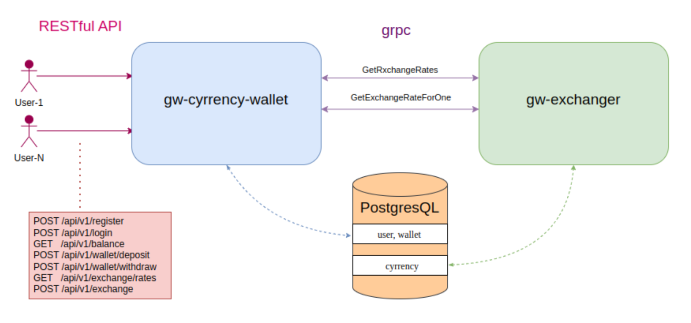

# Приложение - gw-currency-wallet

## Описание

Приложение "Currency-wallet", позволяет создавать аккаунт для пополнения, вывода средств, обмена валют, получения баланса.
Поддерживает 3 основные валюты: USD, RUB, EUR. Приложение поддерживает регистрацию и авторизацию пользователя с использованием
Bearer JWT_TOKEN. Получение курса валют реализованно в отдельном микросервисе и связано с основным приложением по средствам GRPC,
вызовы к обменнику валюты Кэшируются, для лучшей производительности

Состоит из двух микросервисов:
1. Кошелек-обменник с авторизацией (gw-currency-wallet)
    - Авторизация Bearer JWT_TOKEN
    - Получение баланса
    - Пополнение средств
    - Вывод средств
    - Запрос курса валют к gw-exchanger с кэшированием
2. Сервис exchanger для получения курсов валют (gw-exchanger)
    ссылка на gw-exchanger:

   - https://github.com/AndrewTarev/gw-exchanger




## Стек технологий

1. Gin 
2. JWT для авторизации
3. gRPC для получения курсов валют и обмена
4. PostgreSQL основная БД
5. Redis БД для кэширования
6. Docker

## Структура проекта
```
.
├── Makefile
├── README.md
├── cmd
│   └── wallet-app
│       └── main.go
├── deployments                           // Файлы для сборки и деплоя
│   └── docker
│       └── Dockerfile
├── docker-compose.dev.yaml
├── docker-compose.yml
├── docs                                  // Документация Swagger
│   ├── docs.go
│   ├── swagger.json
│   └── swagger.yaml
├── go.mod
├── go.sum
├── internal
│   ├── app                               // Сборка всех компонентов программы
│   │   └── app.go
│   ├── config                            // Конфиг
│   │   ├── config.go
│   │   └── config.yaml
│   ├── delivery                          
│   │   ├── middleware
│   │   │   ├── auth_middleware.go        // Мидлвар авторизауии
│   │   │   ├── err_middleware.go         // Мидлвар обработки ошибок
│   │   │   ├── panic_middlewar.go        // Мидлвар обработки паник
│   │   │   └── validate_middleware.go    // Мидлвар валидации входных данных
│   │   └── rest                          // Слой хэндлеров
│   │       ├── auth_handler.go
│   │       ├── exchange_handler.go
│   │       ├── handler.go
│   │       └── wallet_handler.go
│   ├── errs
│   │   └── errs.go
│   ├── infrastructure                    // Настройки клиента для связи с GRPC сервисом
│   │   └── grpc
│   │       └── exchange_client.go
│   ├── server                            // Настройки сервера
│   │   └── server.go
│   ├── service                           // Слой сервисов
│   │   ├── auth_service.go
│   │   ├── exchange_service.go
│   │   ├── mocks
│   │   │   └── mock_service.go
│   │   ├── service.go
│   │   └── wallet_service.go
│   ├── storage                           // Слой работы с БД (PostgreSQL)
│   │   ├── auth_storage.go
│   │   ├── models                        // Сущности
│   │   │   ├── claims.go
│   │   │   ├── exchange.go
│   │   │   ├── user.go
│   │   │   ├── validate
│   │   │   │   └── validation.go
│   │   │   └── wallet.go
│   │   ├── storage.go
│   │   └── wallet_storage.go
│   └── utils                             // Утилиты для Auth
│       └── jwt_manager.go
├── migrations
│   ├── 000001_init.down.sql
│   └── 000001_init.up.sql
├── pkg                                   // Настройки подключения БД, логгера, Redis
│   ├── db
│   │   └── db.go
│   ├── logging
│   │   └── logger.go
│   └── redis_client
│       └── redis_connection.go
└── tests
    ├── auth_test.go
    ├── exchange_test.go
    └── wallet_test.go
```

## Примеры API-запросов

▎1. Регистрация пользователя

Метод: **POST**  
URL: **/api/v1/auth/register**  
Тело запроса:
```json
{
  "username": "string",
  "password": "string",
  "email": "string"
}
```

Ответ:
• Успех: ```201 Created```
```json
{ 
  "message": "User registered successfully"
}
```

• Ошибка: ```400 Bad Request```
```json
{
   "error": {
      "code": 0,
      "fields": {
         "additionalProp1": "string",
         "additionalProp2": "string",
         "additionalProp3": "string"
      },
      "message": "string"
   }
}
```

▎Описание

Регистрация нового пользователя.
Проверяется уникальность имени пользователя и адреса электронной почты.
Пароль шифруется перед сохранением в базе данных.


---
▎2. Авторизация пользователя

Метод: **POST**  
URL: **/api/v1/auth/login**  
Тело запроса:
```json
{
"username": "string",
"password": "string"
}
```

Ответ:

• Успех: ```200 OK```
```json
{
  "token": "JWT_TOKEN"
}
```

• Ошибка: ```401 Unauthorized```
```json
{
   "error": {
      "code": 0,
      "message": "Invalid username or password"
   }
}
```

▎Описание

Авторизация пользователя.
При успешной авторизации возвращается JWT-токен, который будет использоваться для аутентификации последующих запросов.

---

▎ 3. Получение баланса пользователя

Метод: **GET**  
URL: **/api/v1/wallet/balance**  
Заголовки:  
_Authorization: Bearer JWT_TOKEN_

Ответ:

• Успех: ```200 OK```

```json
{
   "balance": {
      "balance_rub": "decimal.Decimal",
      "balance_usd": "decimal.Decimal",
      "balance_eur": "decimal.Decimal"
   }
}
```

---

▎4. Пополнение счета

Метод: **POST**  
URL: **/api/v1/wallet/deposit**  
Заголовки:  
_Authorization: Bearer JWT_TOKEN_

Тело запроса:
```
{
  "amount": 100.00,
  "currency": "USD" // (USD, RUB, EUR)
}
```

Ответ:

• Успех: ```200 OK```
```json
{
  "message": "Account topped up successfully",
  "new_balance": {
    "USD": "decimal.Decimal",
    "RUB": "decimal.Decimal",
    "EUR": "decimal.Decimal"
  }
}
```

• Ошибка: ```400 Bad Request```
```json
{
   "error": {
      "code": 0,
      "message": "Invalid amount or currency"
   }
}
```

▎Описание

Позволяет пользователю пополнить свой счет. Проверяется корректность суммы и валюты.
Обновляется баланс пользователя в базе данных.

---

▎5. Вывод средств

Метод: **POST**  
URL: **/api/v1/wallet/withdraw**  
Заголовки:  
_Authorization: Bearer JWT_TOKEN_

Тело запроса:
```
{
    "amount": 50.00,
    "currency": "USD" // USD, RUB, EUR)
}
```

Ответ:

• Успех: ```200 OK```
```json
{
  "message": "Withdrawal successful",
  "new_balance": {
    "USD": "decimal.Decimal",
    "RUB": "decimal.Decimal",
    "EUR": "decimal.Decimal"
  }
}
```

• Ошибка: 400 Bad Request
```json
{
   "error": {
      "code": 0,
      "message": "Insufficient funds or invalid amount"
   }
}
```

▎Описание

Позволяет пользователю вывести средства со своего счета.
Проверяется наличие достаточного количества средств и корректность суммы.

---

▎6. Получение курса валют

Метод: **GET**  
URL: **/api/v1/exchange/rates**  
Заголовки:  
_Authorization: Bearer JWT_TOKEN_

Ответ:

• Успех: ```200 OK```
```json
{
    "rates": 
    {
      "USD": "decimal.Decimal",
      "RUB": "decimal.Decimal",
      "EUR": "decimal.Decimal"
    }
}
```

• Ошибка: ```500 Internal Server Error```
```json
{
   "error": {
      "code": 0,
      "message": "Failed to retrieve exchange rates"
   }
}
```

▎Описание

Получение актуальных курсов валют из внешнего gRPC-сервиса.
Возвращает курсы всех поддерживаемых валют.

---

▎7. Обмен валют

Метод: **POST**  
URL: **/api/v1/exchange**  
Заголовки:  
_Authorization: Bearer JWT_TOKEN_

Тело запроса:
```json
{
  "from_currency": "USD",
  "to_currency": "EUR",
  "amount": 100.00
}
```

Ответ:

• Успех: ```200 OK```
```json
{
  "message": "Exchange successful",
  "exchanged_amount": 85.00,
  "new_balance":
  {
  "USD": 0.00,
  "EUR": 85.00
  }
}
```

• Ошибка: 400 Bad Request
```json
{
   "error": {
      "code": 0,
      "message": "Insufficient funds or invalid currencies"
   }
}
```

▎Описание

Курс валют осуществляется по данным сервиса exchange (если в течении небольшого времени был запрос от клиента курса валют (**/api/v1/exchange**) до обмена, то
брать курс из кэша, если же запроса курса валют не было или он запрашивался слишком давно, то нужно осуществить gRPC-вызов к внешнему сервису, который предоставляет актуальные курсы валют)
Проверяется наличие средств для обмена, и обновляется баланс пользователя.


## Установка приложения:

1. Склонируйте репозиторий себе на компьютер
   - `git clone https://github.com/AndrewTarev/gw-currency-wallet`
2. Установите свои переменные в .env файл или используйте стандартные
3. Создайте общую приватную сеть в Docker, для связи микросервисов
   - `docker network create my_network`
4. Запустите сборку контейнеров
   - `docker-compose up --build`
5. Для корректной работы приложения вам нужно будет по аналогии скачать и запустить микросервис `gw-exchanger`, для этого
склонируйте приложение в отдельный репозиторий:
   - `git clone https://github.com/AndrewTarev/gw-exchanger.git`
6. Запустите сборку контейнеров:
   - `docker-compose up --build`

API документация (Swagger/OpenAPI) доступна по пути http://localhost:8080/swagger/index.html
